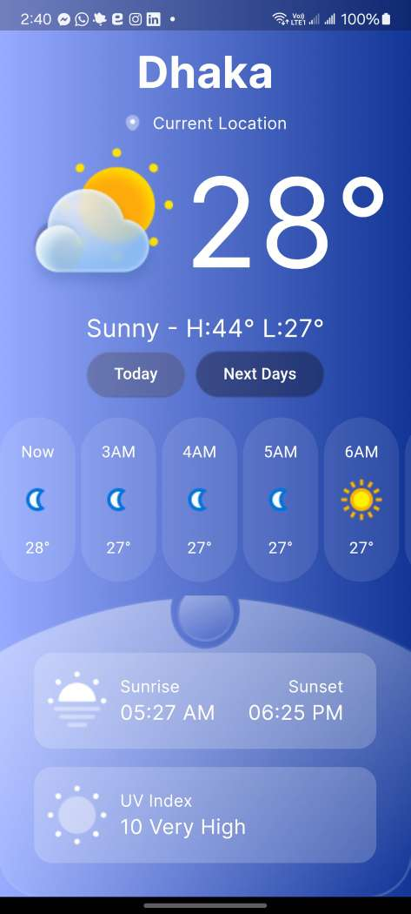

# Flutter Weather App

A visually appealing weather app built with Flutter that provides current weather conditions and a 3-day forecast. Users can view temperature, weather description, wind speed, humidity, pressure, visibility, and more. The app retrieves weather data from a public weather API and uses location services to fetch data specific to the user's location. Additionally, users can manually enter a location and switch between Celsius and Fahrenheit units.

## Features

- View current weather conditions including temperature, weather description, wind speed, humidity, pressure, visibility, etc.
- Display forecast for the next 3 days with date, weather icon, and temperature.
- Automatically fetch weather data based on the user's location using location services.
- Manually enter a location (if possible) to fetch weather data for that location.
- Unit conversion between Celsius and Fahrenheit.
- Persist fetched data locally for offline access (bonus point feature).
- Includes animations/transitions for enhanced user experience (bonus point feature).
- Utilizes dependency injection and Singleton pattern.

## Architecture and Design Patterns

- **MVVM (Model-View-ViewModel)**: Separates concerns and facilitates maintainability.
- **Repository Pattern**: Abstracts data layer for easier testing and scalability.

## State Management

- **Bloc (Business Logic Component)**: Manages application state using Bloc pattern for better organization and separation of concerns.

## Networking and Database

- **HTTP Client**: Utilizes `http` package for API requests.
- **SQFlite**: Stores fetched data locally with SQFlite package.

## Error Handling

- Centralized API call error handling provides meaningful feedback to users in case of network errors.

## Navigation

- Utilizes Flutter's built-in navigation system for seamless navigation between screens.

## GitHub Repository

The source code for this project is hosted on GitLab. You can access the repository [here](https://github.com/mFerdous/weather).

## Screenshots

## Future Scope

- Refine codebase based on feedback and emerging requirements.
- Implement additional features and enhancements to improve code quality and user experience.
